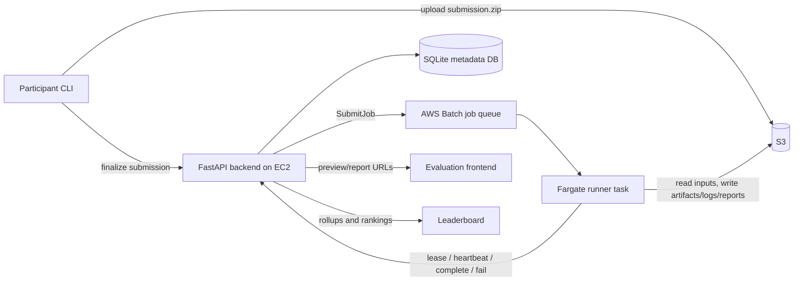

# AWS Batch Fargate Runner Architecture

Vis Arena can keep the FastAPI backend on one EC2 instance while offloading
evaluation execution to one ephemeral AWS Batch on Fargate task per job. The
backend remains the control plane and source of truth for submissions, jobs,
rollups, peer reviews, leaderboards, and artifact metadata.

## Job Lifecycle

1. Submission finalization validates the uploaded bundle and creates `jobs`
   rows for each active public task.
2. If `VIS_ARENA_EXECUTOR_MODE=aws_batch_fargate`, the backend submits each
   queued job to AWS Batch and records `executor`, `external_job_id`, and
   `dispatched_at` on the job row.
3. AWS Batch starts a Fargate task from the `vis-arena-evaluator-runner` image.
4. The runner calls `GET /internal/jobs/{job_id}/lease` using a job-scoped
   token. The backend marks the job `running` and returns job metadata plus S3
   object keys.
5. The runner downloads the submission and dataset from S3, stages the workdir,
   runs generation and evaluation inside the Fargate task, and uploads artifacts,
   previews, logs, trajectories, and reports back to S3.
6. While running, the task posts `POST /internal/jobs/{job_id}/heartbeat`; the
   backend stores `last_heartbeat_at`.
7. On success, the runner posts `POST /internal/jobs/{job_id}/complete` with the
   same result shape used by the local worker. The backend writes job metadata,
   self-evaluation rows, rollups, central/peer evaluation queues, and leaderboard
   inputs.
8. On failure, the runner posts `POST /internal/jobs/{job_id}/fail`; the backend
   records the error and updates the same rollup state as the local worker.

Local development keeps `VIS_ARENA_EXECUTOR_MODE=local_docker` and uses the
existing `vis-arena-worker` command.

## Service Choice Rationale

AWS Batch on Fargate is a good v1 fit because evaluation jobs are containerized,
bursty, and longer-running than normal request handlers. Batch gives queueing,
managed retries, timeouts, CloudWatch logs, and a simple concurrency cap without
running a separate worker fleet.

Lambda is not a good fit for this workload because participant agents can need a
full browser stack, filesystem staging, larger dependencies, and runtimes beyond
short function limits.

Batch on EC2 is worth considering later if jobs need Docker-in-Docker, GPUs,
large local disks, custom AMIs, or lower per-vCPU cost at sustained high volume.
For low concurrency, Fargate avoids instance management and keeps isolation
simple.

## Runtime Model

The Fargate task is the execution boundary. The runner does not start nested
Docker; it executes the same arena phase script directly inside the task image.
The image includes Playwright, `uv`, the server package, and the arena SDK.

The backend submits each Batch job with a short-lived job-scoped JWT. Internal
runner endpoints reject tokens whose `scope` is not `runner-job` or whose
subject does not match the URL job id.

Heartbeats are advisory. They make stuck jobs observable in the backend and can
support future stale-job cleanup. AWS Batch job timeouts remain the hard runtime
limit.

## Cost Notes

Common starting sizes:

| Size | Typical use |
| --- | --- |
| `1 vCPU / 2 GB` | Lightweight agents and small datasets |
| `2 vCPU / 4 GB` | Default v1 size for generation plus self-evaluation |
| `4 vCPU / 8 GB` | Heavier browser work or larger data transforms |

Example: a 20-minute generation plus self-evaluation run at `2 vCPU / 4 GB`
uses about `0.667 vCPU-hours` and `1.333 GB-hours`. Multiply those quantities
by the current Fargate Linux x86 prices in the deployment region.

Also budget for CloudWatch log ingestion/storage, S3 storage and requests,
public IPv4 charges, NAT Gateway charges if private subnets are used, and LLM
provider costs. LLM costs will usually dominate compute cost for complex agents.
